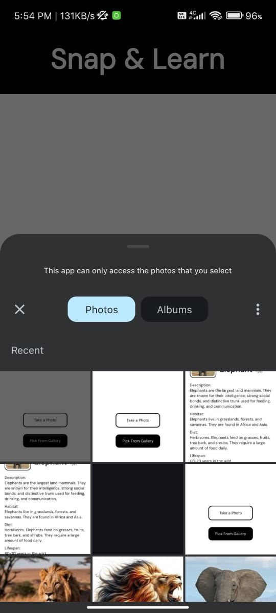
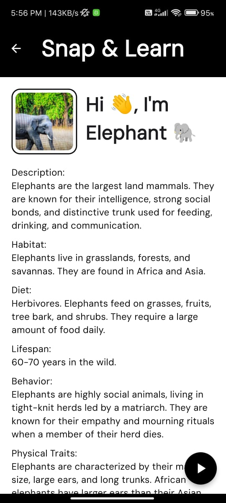

    
     
    <h1>Snap & Learn 📸🐾</h1>
    
A Flutter-based mobile application that recognizes animals and provides detailed information about them.

---

  
  
  

## Features
- **Animal Recognition**: Identify animals from photos and get in-depth information.
- **Detailed Animal Information**: Learn about the animal's habitat, diet, lifespan, behavior, physical traits, and fun facts.
- **Text-to-Speech Narration**: Listen to a description of the animal using a built-in TTS feature.
- **Clean and Minimal UI**: Enjoy a simple, user-friendly interface.
- **Animal-specific Recognition**: Works for **Dogs**, **Cats**, **Tigers**, **Lions**, **Kangaroos**, **Pandas**, **Penguins**, and **Elephants**.

## Screenshots
Check out some of the app's features below:

- **Animal Recognition Screen**
- **Text-to-Speech Narration**
- **Animal Details Screen**

---

## Installation

---

## Acknowledgments
- [**Teachable Machine**](https://teachablemachine.withgoogle.com/): Used for training the animal recognition model with custom images.

- [**TTS API**](https://www.text-to-speech-api.com/): Text-to-speech functionality.
- [**Flutter**](https://flutter.dev/): Open-source framework for building beautiful and fast apps.

---

Thank you for using **Snap & Learn**! If you enjoy this project, please star the repository 🌟 and share it with others!

